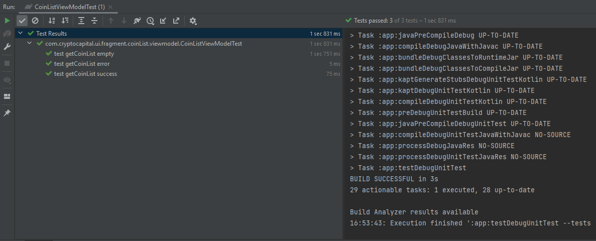
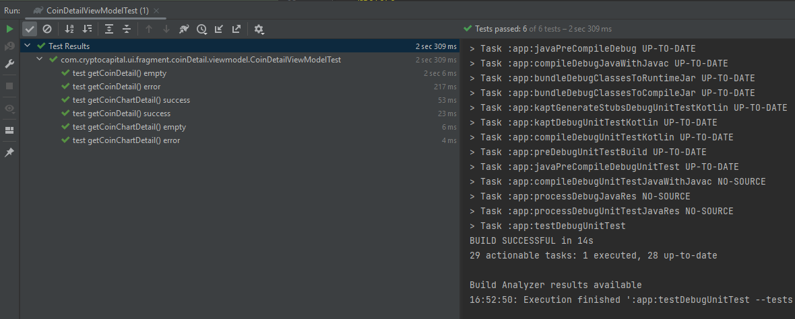
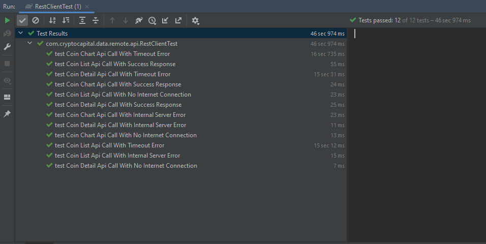
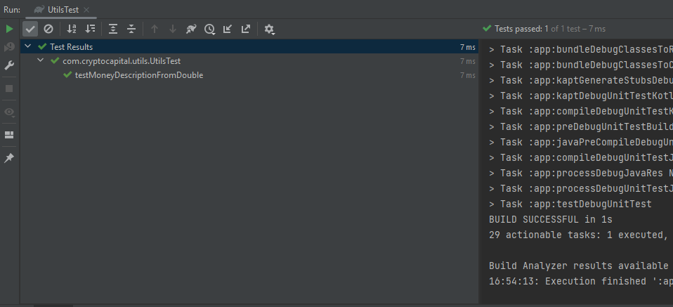

# Crypto Capital - Clean Architecture with MVVM Kotlin
The Crypto Capital - App consuming a [CoinGecko API](https://www.coingecko.com/en/api) to display top 100 crypto coins it has been built with clean architecture principles, Repository Pattern, and MVVM pattern as well as Architecture Components.

This app also shows the usage of the Navigation Architecture Component.

**App features:**
- List of Top 100 Crypto Coins
- Detail of Coins
- Price changes of coin in a graph

## Screenshots

## Architecture
The Clean Architecture MVVM pattern emphasizes the separation of concerns and modularity of code by organizing it into distinct layers. The pattern encourages a clear separation between business logic and presentation logic, and promotes testability and maintainability of the codebase. This approach can be particularly useful for large-scale projects, where code organization and scalability become increasingly important. In this approach, the Clean Architecture principles are combined with the MVVM (Model-View-ViewModel) pattern and implemented using the Kotlin programming language.

## Modules:
* **app module** - It uses all the components and classes related to Android Framework. It gets the data from domain layer and shows on UI. (**access all the modules**)
* **data** - The data layer implements the repository interface that the domain layer defines. This layer provide a single source of truth for data. It contains `remote` (which holds code to get data from webserver), `Local` (which holds code to get data from local DB ), `sharedPref` (which holds code to get data from Shared Preference) (Kotlin module that **can only access domain module**)
* **domain** - The domain layer contains the UseCases that encapsulate a single and very specific task that can be performed. This task is part of the business logic of the application. (Kotlin module that **cannot access any other module**)
* **base_module** - Contains all the base classes like `BaseFragment`, `BaseViewModel` and `BaseAdapter` which helps to reduce the duplication of the code. (**access data and domain modules**)

## Module and Package Structure
**App Module Layer**

    com.cleanarchitecture.cryptocapital     # Root Package
    ├── data                    # For data handling.
    │   ├── resource            # Resource class to handle the different possible outcomes
    |
    ├── di                  
    │   └── app koin module     # dependency injection for app layer
    |
    ├── ui  
    |   ├── activity            # Activities in the apps
    |   |   ├── main            # Main Activity 
    |           ├── adapter     # Adapters used in main activity
    |           └── viewmodel   # View Models used in main activity 
    |   ├── fragment            # Fragments in the apps
    |   |   ├── coinlist        # Coin List Fragment 
    |           ├── adapter     # Adapters used in Coin List Fragment
    |           └── viewmodel   # View Models used in Coin List Fragment
    |
    └── utils                   # Utility Classes

**Base Module Layer**

    com.digi.base_module     # Root Package
    ├── base
    |   ├── base fragment       # For reducing duplicate code in fragments.
    |   ├── base adapter        # For reducing duplicate code in adapters.
    |   └── base viewmodel      # For reducing duplicate code in viewmodels.
    |
    ├── extensions                  
    │   └── context extension   # extensions classes to reduce boiler code
    |
    ├── navigation                  
    │   └── navigation command   # a data class to handle fragment navigation
    |
    └── utils                   # Utility Classes

**Data Module Layer**

    com.cleanarchitecture.data     # Root Package
    ├── repository
    |   ├── RemoteRepoImpl      # This class will implement remote interface declared in domain layer
    |   ├── SharedPrefRepoImpl  # This class will implement sharedPref interface declared in domain layer
    |   └── LocalRepoImpl       # This class will implement local interface declared in domain layer 
    |
    ├── source                 
    │   ├── remote              
    |   │   └── api             # Retrofit API for remote end point.
    │   ├── local                  
    |   │   └── room            # Room DB for local database.
    │   └── sharedPref            
    |       └── tinyDB          # helper class to use sharedPref Easily
    |
    └── koin                  
        └── data koin module    # dependency injection for data layer

**Domain Module Layer**

    com.cleanarchitecture.domain     # Root Package
    ├── interactor
    |   ├── use cases                    # mediator between the app layer and the data layer,
    |
    ├── repository                      
    │   ├── remote repo interface        # remote methods that is implemented in data layer
    │   ├── sharedpref repo interface    # sharedPref methods that is implemented in data layer    
    │   └── local repo interface         # local DB methods that is implemented in data layer
    |
    ├── koin                  
    │   └── domain koin modules          # dependency injection for domain layer
    |
    ├── model                  
    │   └── data class                   # POJO classes
    |
    └── response                         # A wrapper class to handle possible outcomes from remote 

## Built With 🛠
- [Kotlin](https://kotlinlang.org/) - First class and official programming language for Android development.
- [Coroutines](https://kotlinlang.org/docs/reference/coroutines-overview.html) - For asynchronous and more..
- [Android Architecture Components](https://developer.android.com/topic/libraries/architecture) - Collection of libraries that help you design robust, testable, and maintainable apps.
    - [LiveData](https://developer.android.com/topic/libraries/architecture/livedata) - Data objects that notify views when the underlying database changes.
    - [ViewModel](https://developer.android.com/topic/libraries/architecture/viewmodel) - Stores UI-related data that isn't destroyed on UI changes.
    - [ViewBinding](https://developer.android.com/topic/libraries/view-binding) - Generates a binding class for each XML layout file present in that module and allows you to more easily write code that interacts with views.
- [Koin](https://insert-koin.io) - Dependency Injection Framework
- [Retrofit](https://square.github.io/retrofit/) - A type-safe HTTP client for Android and Java.
- [GSON](https://github.com/google/gson) - A Java serialization/deserialization library to convert Java Objects into JSON and back.
- [GSON Converter](https://github.com/square/retrofit/tree/master/retrofit-converters/gson) - A Converter which uses Gson for serialization to and from JSON.
- [OkHttp3](https://github.com/square/okhttp) -  For implementing interceptor, logging and mocking web server.
- [Glide](https://github.com/bumptech/glide) - An image loading and caching library for Android focused on smooth scrolling.
- [MP Chart](https://github.com/PhilJay/MPAndroidChart) - A powerful & easy to use chart library for Android
- [Material Components for Android](https://github.com/material-components/material-components-android) - Modular and customizable Material Design UI components for Android.
- [Mockito-Kotlin](https://github.com/nhaarman/mockito-kotlin) for mocking in tests.
- [MockWebServer](https://github.com/square/okhttp/tree/master/mockwebserver) for Instrumentation tests.
- [AndroidX Test Library](https://github.com/android/android-test) for providing JUnit4 and functions as `launchActivity` in UI tests

## Unit Testing
Covered Coin List ViewModel, Coin Detail ViewModel, Rest Client and Utility Testing.

- ### CoinListViewModel Unit Test
    
- ### CoinDetailViewModel Unit Test
     
- ### RestClient Unit Test
    
- ### Utility Class Unit Test
    